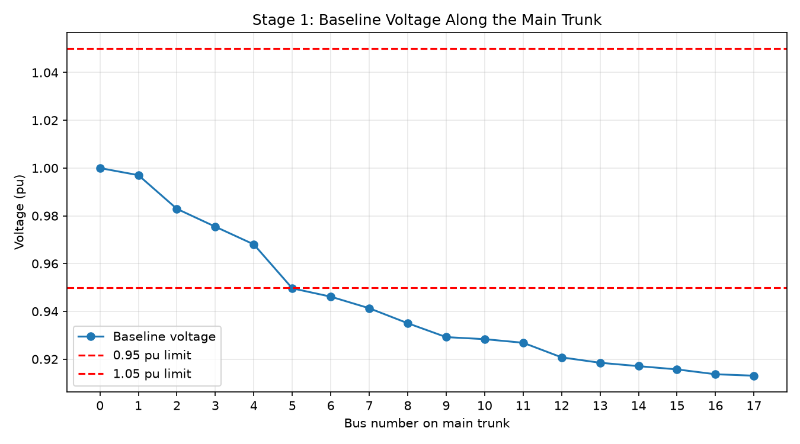
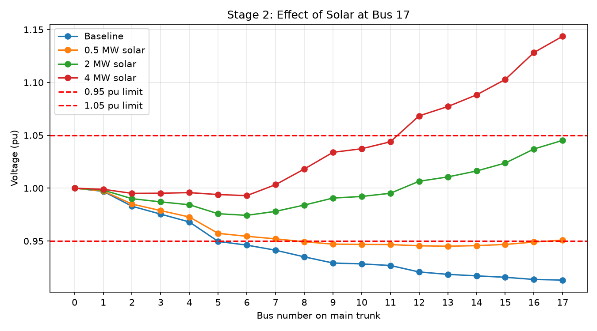
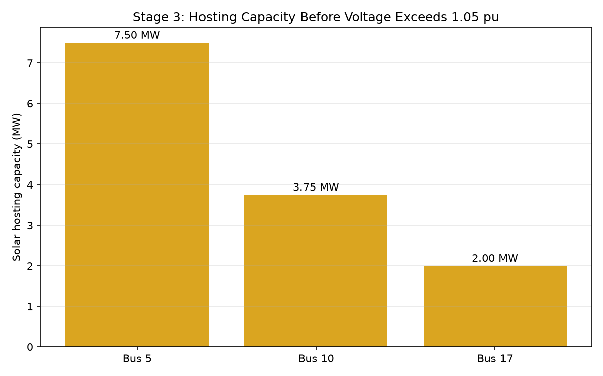

# Solar Hosting Capacity on a Distribution Feeder

This project uses a power-flow model to estimate how much solar generation a simple distribution feeder can host before voltage becomes too high. It uses pandapower's built-in 33-bus, 12.66 kV radial test feeder and compares solar connected at three locations.

## Project files

- `feeder_study.py` runs the full study and creates the plots.
- `requirements.txt` lists the required Python packages.
- `outputs/` contains the plots generated by the study.

## Requirements

- Python 3.10 or newer
- pip

## Run the project

Open PowerShell in the project folder and run:

```powershell
python -m venv .venv
.\.venv\Scripts\python.exe -m pip install -r requirements.txt
.\.venv\Scripts\python.exe .\feeder_study.py
```

The script prints the results in the terminal and writes three PNG files to `outputs/`.

## What the study does

1. Loads the built-in 33-bus feeder and runs a baseline power flow.
2. Checks that buses 0 through 17 form the main trunk used in the voltage plots.
3. Adds solar at bus 17 and tests 0.5 MW, 2.0 MW, and 4.0 MW.
4. Tests solar at buses 5, 10, and 17 in 0.25 MW steps.
5. Stops each search when the maximum voltage anywhere on the feeder is above 1.05 per unit.

## Results

### Baseline feeder



With no solar, the minimum voltage is 0.9131 pu at bus 17 and the maximum is 1.0000 pu at the source. Voltage falls along the feeder because power traveling through the lines causes a voltage drop.

### Solar at the far end



| Solar at bus 17 | Minimum voltage | Maximum voltage |
|---:|---:|---:|
| 0 MW | 0.9131 pu | 1.0000 pu |
| 0.5 MW | 0.9245 pu | 1.0000 pu |
| 2.0 MW | 0.9437 pu | 1.0453 pu |
| 4.0 MW | 0.9625 pu | 1.1437 pu |

Small amounts of solar reduce the voltage drop near the end of the feeder. Larger solar output can send power back toward the source and raise voltage above the limit.

### Voltage hosting capacity



| Solar location | Last passing size | First size above 1.05 pu |
|---:|---:|---:|
| Bus 5 | 7.50 MW | 7.75 MW |
| Bus 10 | 3.75 MW | 4.00 MW |
| Bus 17 | 2.00 MW | 2.25 MW |

The main result is that solar connected farther from the source causes a larger voltage rise. Bus 5 can host more solar because it is electrically closer to the source. Bus 17 can host less because more line impedance separates it from the source.

## Notes and limits

- This is a generic 12.66 kV textbook feeder, not a real utility network.
- The study uses one load condition and does not include changing sunlight or load over time.
- The voltage rule is simplified to 0.95 pu to 1.05 pu.
- The study checks voltage only. It does not check thermal loading, protection, losses, fault current, or equipment controls.
- The 0.25 MW search step gives the hosting-capacity result a 0.25 MW resolution.
